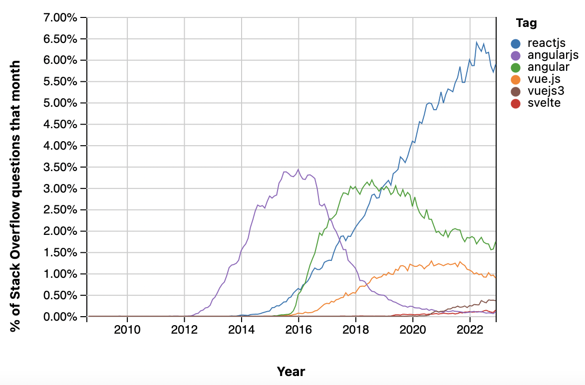
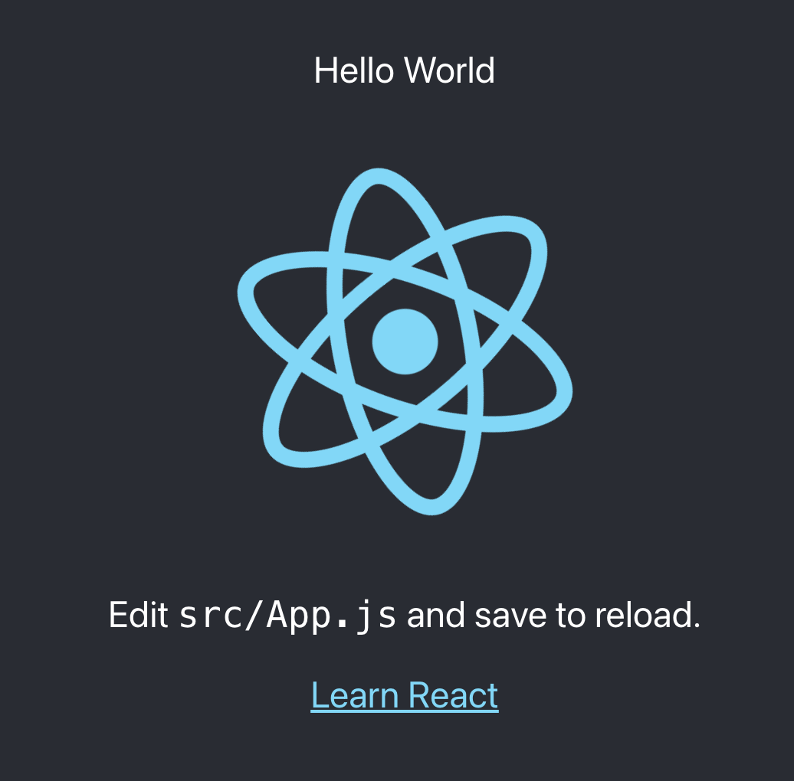

# Week 1: Introduction and Setup

- [Node.js](#nodejs)
  - [npm and Yarn](#npm-and-yarn)
  - [Installing Node.js and npm](#installing-nodejs-and-npm)
  - [Installing Yarn](#installing-yarn)
- [React](#react)
- [Create React App](#create-react-app)
  - [Using Yarn](#using-yarn)
  - [Running the App](#running-the-app)
  - [Hello World](#hello-world)
- [Additional Resources](#additional-resources)

Welcome! Today we will introduce relevant technologies and set up our development environment.


## Node.js
Node.js is an open-source JavaScript runtime envinronment that will enable us to execute JavaScript code outside of the browser. It will provide the infrastructure for us to develop web applications.

### npm and Yarn
npm (Node Package Manager) is Node.js's default package manager. It is used to to manage and install external packages and modules for our applications. It has access to over 1 million packages in a database known as the npm registry.

Yarn is another package manager, which we prefer over npm because of speed and security benefits.

### Installing Node.js and npm
Install Node.js (and along with it npm) at [the download link](https://nodejs.org/en/download/). Use the LTS version for your operating system.

### Installing Yarn
Install Yarn with the following command in your terminal:

```
sudo npm install -g yarn
```

## React
React is the most popular JavaScript framework for developing front-end applications. It is primarily maintained by Meta. Here is a graph of question activity from Stack Overflow trends comparing React with its top competitors:



From the [official website](https://reactjs.org/), here are React's core tenets:

**Declarative:**
Declarative code describes what you want a program to do, and not how to actually do it. This characteristic makes React much more intuitive to learn and use.

**Component-Based:**
The fundamental building blocks of React applications are components. The modularization provided by descrete components makes code much easier to maintain and debug.

**Learn-Once, Write Everywhere:**
React makes no assumptions about the rest of your technology stack, and will work seamlessly with other technologies that you integrate with your application.

## Create React App
Create React App is a fully integrated environment that will allow you to develop a web application without any additional setup. To create a template application using this tool, run the following command:

```
npx create-react-app <app name>
```

Note the npx command above. It also interacts with the npm registry just like the npm command, but only executes the specified package instead of installing it.

This will create a folder in a current directory. Inside the folder, first take note of the `package.json` and `package-lock.json` files, and the `node_modules` folder. 

* `package.json` contains metadata about your setup, including a list of dependencies that your application relies on. 

* `package-lock.json` is an file auto-generated by npm that contains an exact installation order of these dependencies, so that other developers can replicate your project setup. 

Both of these files should be committed in source control if you use npm. 

* The `node_modules` folder contains the dependencies themselves. Its contents should not be committed to source control because other users can generate it themselves using the two aforementioned files.

### Using Yarn
Yarn generates its own equivalent of `package-lock.json`, called `yarn.lock`. To use Yarn, delete the `package-lock.json file`, and run the command

```
yarn install
```

The `yarn.lock` file should now appear in your directory, and you can now use Yarn instead of npm.

### Running the App
To run the app, use the command
```
yarn start
```

The following screen should launch in your browser:


### Hello World

As indicted on the screen, the driving code behind this screen is located at `src/app.js`. Let's go there and take a look!

```js
import logo from './logo.svg';
import './App.css';

function App() {
  return (
    <div className="App">
      <header className="App-header">
        
        <p>
          Edit <code>src/App.js</code> and save to reload.
        </p>
        <a
          className="App-link"
          href="https://reactjs.org"
          target="_blank"
          rel="noopener noreferrer"
        >
          Learn React
        </a>
      </header>
    </div>
  );
}

export default App;
```

Remember that React is built upon components. In modern React, each component corresponds with a function. In this case, the entire page displayed on the browser corresponds with a single component: `App`. 

Look at the return value of the `App` function. It looks a lot like HTML, but is actually syntactic sugar in JavaScript called JSX (Javascript XML). JSX allowed us to outline the exact layout of a component using familiar HTML syntax.

Note that JSX is not identical to HTML because JavaScript contains several reserved keywords. The most notable example is ```class```, which is why we use ```className``` in JSX instead.

Now let's edit the component so that it also displays "Hello World" to the screen. We can do so by adding a `<p>` tag:

```js
function App() {
  return (
    <div className="App">
      <header className="App-header">
        <p>Hello World</p>
        
...
```

Our "Hello World" text now appears exactly where we expect it to:



That's all for today! Be sure to check out the resources below for more information on Node.js and React!

## Additional Resources

Node.js

[Accessible Node.js Introduction](https://www.tutorialspoint.com/nodejs/nodejs_introduction.htm)

React

[Official React Overview](https://reactjs.org/docs/getting-started.html)
