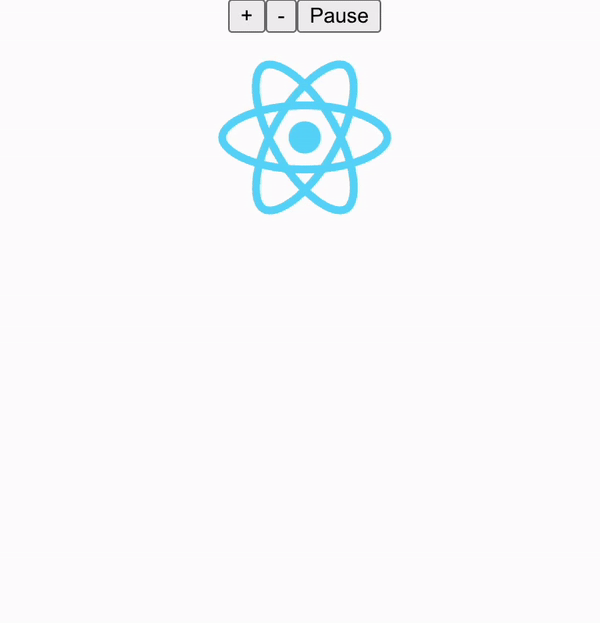

# Week 4: useEffect

Welcome! Today we will learn about another common React hook: `useEffect`!

## Side Effects

**Side effects** are operations that occur outside the React rendering process. Common examples of side effects include setting timers, accessing browser APIs, and interfacing with a backend.

If we attempt to put side effect code inside the main body of our component function, we tie side effect execution into the component rendering process. This will result in undefined behavior with more complex side effects, as we do not have direct control over when a component re-renders in React (see last week's content for more info on this). To control the execution of side effects, we must use the `useEffect` hook.

## useEffect

`useEffect` will separate side effect execution from the rendering process by guaranteeing that the side effect is not evaluated until after the rendering process is complete. Let's take a look at its basic syntax:

```JavaScript
useEffect(() => {
  document.title = `Welcome, ${name}!`;
});
```

Here, we are taking advantage of a browser API to set the title of the page to greet you based on your name. In its simplest form, the `useEffect` hook only needs a single argument: a callback function representing your side effect.

### Dependency Array
In its current form, the `useEffect` function will execute its callback every time the page re-renders. Now this will lead to a lot of wasted work, as we will be repeatedly updating the document title even when the `name` variable has not changed from the previous render. To change this behavior, we will need to pass a second argument to the hook: a **dependency array**.

```JavaScript
useEffect(() => {
  document.title = `Welcome, ${name}!`;
}, [name]);
```

After the initial render and side effect evaluation, the dependency array will ensure that the callback is only executed again when one of its elements changes value. In this case, we only want to update the document title based on changes to the `name` variable, so we pass it to the dependency array.

A special case worth mentioning is the empty dependency array. Use this when you never want to re-evaluate the callback after the initial render. A potential use case is if you want to statically set the title of your webpage:

```JavaScript
useEffect(() => {
  document.title = "Welcome to the Page!";
}, []);
```

As a final recap:
- No dependency array: callback executed on **every** render
- Empty dependency array ([]): callback only executed on initial render
- Non-empty dependency array ([a,b,c]): callback executed when any element changes value

### Cleanup Function
Updating the page title is a simple side effect that does not require additional cleanup. However, more complex side effects will require explicit cleanup to perform tasks such as tearing down connections and deallocating objects from memory. Let's consider another example:

```JavaScript
useEffect(
  setTimeout(() => (console.log("Timer Done!")), 10000);
), [reset];
```

Imagine that `reset` is simply a boolean flag variable controlled by a button. When this button is clicked, the code will create a new object in memory that sets a 10-second timer and outputs `"Timer Done!"` after the timer expires. 

If the timer expires after 10 seconds, it will automatically clean up after itself. However, if we manually reset the timer by changing the value of the `reset` flag, we will create a new object corresponding with the new timer. The object representing the old timer is now a memory leak.

To address this issue, we must use a **cleanup function**. The cleanup function will execute before every re-evaluation of the callback (it will not execute before the initial callback evaluation because there will be nothing to clean up) to avoid unintended behaviors stemming from the previous side effect execution. We incorporate the cleanup function as follows:

```JavaScript
useEffect(() => {
    timer = setTimeout(() => (console.log("Timer Done!")), 10000);
    return () => clearTimeout(timer);
  }
), [reset];
```

The `setTimeout` function actually returns an ID for the timer object it creates, which we store in the variable `timer`. We then pass this ID to the `clearTimeout` function to clean up the object.

If we need a cleanup function, we will declare it by setting it as the return value of the callback.

## Coding Example

Let's put everything we've learned into practice by integrating `useEffect` into our code from last week to add a new auto-scaling feature to the React logo. Remember to now include `useEffect` as an import:

```JavaScript
import React, {useState, useEffect} from 'react'
```

In our `App.js` file, we will first define a boolean state `auto` that indicates whether auto-scaling is active or not:

```JavaScript
const [auto, setAuto] = useState(false)
```

Next, we will add a button for toggling this state:

```JavaScript
return (
  <div className="App">
    <div>
      <button onClick={handleClickInc}>+</button>
      <button onClick={handleClickDec}>-</button>
      <button onClick={handleClickAuto}>{auto ? "Pause" : "Play"}</button>
    </div>
    <ImageDisplay url={logo} alt={"React logo"} width={size}/>
  </div>
)
```

Now we will add the `handleClickAuto` function for processing button clicks:

```JavaScript
function handleClickAuto() {
  setAuto(auto => !auto)
}
```

We also want to disable the manual size adjustment buttons while autoscaling is in effect. This is easily accomplished by checking the value of `auto` in the buttons' respective handler functions:

```JavaScript
function handleClickInc() {
  if (!auto)
    setSize(prevSize => prevSize + 10)
}

function handleClickDec() {
  if (!auto)
    setSize(prevSize => prevSize - 10)
}
```

Finally, we will add our `useEffect` hook, which increase the button in 100-pixel size increments every second until reaching 500 pixels, before resetting back to 100 pixels. To accomplish this, we will use the `setInterval` function, which has identical syntax to `setTimeout`. However, when the initial timer expires, `setInterval` will indefinitely repeat the timer (generating fixed intervals) instead of terminating.

```JavaScript
useEffect(() => {
  let interval = null;
  if (auto)
    interval = setInterval(() => {
      setSize(prevSize => (prevSize % 500 + 100))
    }, 1000)
  return () => clearInterval(interval)
}, [auto])
```

After pressing the `Play` button, your image should auto-scale as follows:



A copy of the completed code can be found in the `week4-app-final` folder.

## Recap

`useEffect` can be used to evaluate side effects in React components. After the component initially finishes rendering, the hook will execute the code inside its callback function. On additional re-renders, the hook will perform the following actions:

1. if present, run the cleanup function to clean up the previous side effect execution
2. determine whether to execute the callback based on the dependency array
3. if needed, execute the callback

When the component leaves the page for good, the cleanup function will execute one last time to account for the last execution of the callback.

That's it for this week! Be sure to check out the resources below. Next week we will learn about an additional hook that can expand the power of `useState`: `useContext`!

## Additional Resources
[useEffect Official Documentation](https://beta.reactjs.org/reference/react/useEffect)<br/>
[setTimeout](https://developer.mozilla.org/en-US/docs/Web/API/setTimeout)<br/>
[Cleanup Function](https://maxrozen.com/demystifying-useeffect-cleanup-function)<br/>